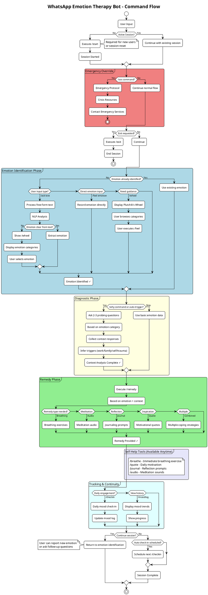
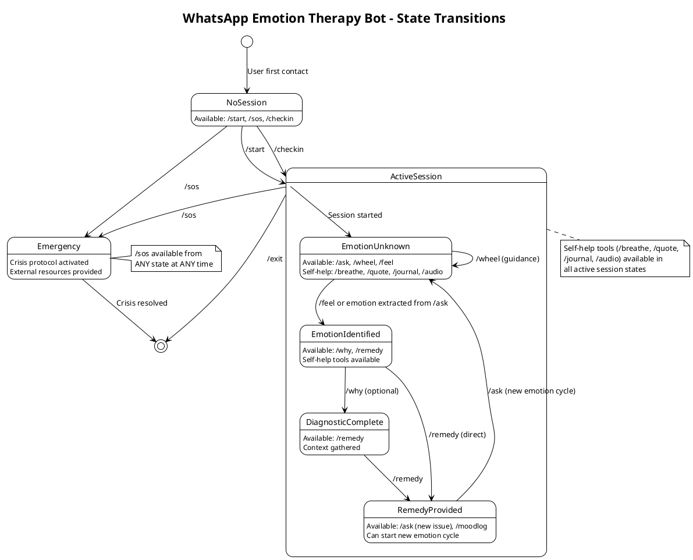

# 🔄 Command Flow DAG

## Entry Points
```
[User Input] → /start (Required for new session)
```

## Main Flow Paths

### Path 1: Direct Emotion Input
```
/start → /feel <emotion> → /why → /remedy → [Self-help tools] or /exit
```

### Path 2: Free-form Conversation
```
/start → /ask <text> → [NLP Analysis] → /wheel (if emotion unclear) → /feel <emotion> → /why → /remedy
```

### Path 3: Exploration Mode
```
/start → /wheel → /feel <emotion> → /why → /remedy
```

## Command Dependencies & Rules

### 🚪 **Session Management**
- **`/start`** - Required before any other command (except `/sos`)
- **`/exit`** - Can be used at any time to end session

### 🎯 **Emotion Identification Phase**
- **`/ask <text>`** - Available after `/start` for free-form input
- **`/wheel`** - Can follow `/start` or `/ask` when emotion is unclear
- **`/feel <emotion>`** - Can follow `/start`, `/ask`, or `/wheel`

### 🔍 **Diagnostic Phase**
- **`/why`** - Only available after emotion is identified via `/feel`
- Prerequisite: User must have used `/feel <emotion>`

### 💡 **Remedy Phase**
- **`/remedy`** - Available after `/why` or directly after `/feel`
- Prerequisite: Emotion must be identified

### 🛠️ **Self-Help Tools** (Available anytime after `/start`)
- **`/breathe`** - Immediate breathing exercise
- **`/quote`** - Motivational quote
- **`/journal`** - Journaling prompt
- **`/audio`** - Meditation audio

### 📊 **Tracking & Monitoring**
- **`/checkin`** - Daily check-in (can start new session)
- **`/moodlog`** - View mood history (requires active session)

### 🚨 **Emergency**
- **`/sos`** - Available at ANY time, bypasses all flows

## Flow States

### State 1: No Active Session
```
Available: /start, /sos, /checkin
```

### State 2: Session Started, No Emotion Identified
```
Available: /ask, /wheel, /feel, /breathe, /quote, /journal, /audio, /exit, /sos
```

### State 3: Emotion Identified
```
Available: /why, /remedy, /breathe, /quote, /journal, /audio, /moodlog, /exit, /sos
```

### State 4: Diagnostic Complete
```
Available: /remedy, /breathe, /quote, /journal, /audio, /moodlog, /exit, /sos
```

### State 5: Remedy Provided
```
Available: /ask (new issue), /checkin, /moodlog, /breathe, /quote, /journal, /audio, /exit, /sos
```

## Visual Flow

### Complete Flow Diagram



### State Transition Diagram



## Command Priority Rules

1. **`/sos`** - Highest priority, interrupts any flow
2. **`/exit`** - Second priority, can end any session
3. **`/start`** - Required before other commands (session gate)
4. **Flow commands** - Must follow logical sequence
5. **Self-help tools** - Available as support at any active session state

## Implementation Notes

- **Session State**: Track current user state (NoSession, EmotionUnknown, EmotionIdentified, etc.)
- **Command Validation**: Validate commands against current state before execution
- **Emergency Override**: `/sos` should bypass all validation and state checks
- **Context Preservation**: Maintain emotion and diagnostic data throughout session
- **Graceful Degradation**: Allow users to skip diagnostic phase if desired
- **Cyclical Flow**: Users can identify multiple emotions in one session
